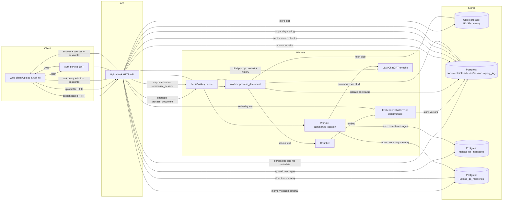

# Upload & Ask Architecture

```mermaid
flowchart LR
    subgraph Client [Client]
        direction TB
        Web[Web client Upload & Ask UI]
        Auth[Auth service JWT]
    end

    subgraph API [API]
        direction TB
        Gateway[UploadAsk HTTP API]
    end

    subgraph Workers [Workers]
        direction TB
        Queue[Redis/Valkey queue]
        Processor[Worker: process_document]
        Summarizer[Worker: summarize_session]
        Chunker[Chunker]
        Embedder[Embedder ChatGPT or deterministic]
        LLM[LLM ChatGPT or echo]
    end

    subgraph Stores [Stores]
        direction TB
        Storage[(Object storage R2/S3/memory)]
        DocRepo[(Postgres: documents/files/chunks/sessions/query_logs)]
        MsgRepo[(Postgres: upload_qa_messages)]
        MemRepo[(Postgres: upload_qa_memories)]
    end

    %% Auth
    Web -->|login| Auth
    Auth -->|JWT| Web
    Web -->|authenticated HTTP| Gateway

    %% Upload flow
    Web -->|upload file + title| Gateway
    Gateway -->|persist doc and file metadata| DocRepo
    Gateway -->|store blob| Storage
    Gateway -->|enqueue process_document| Queue
    Queue --> Processor
    Processor -->|fetch blob| Storage
    Processor -->|chunk text| Chunker
    Chunker -->|embed| Embedder
    Embedder -->|store vectors| DocRepo
    Processor -->|update doc status| DocRepo

    %% Ask flow
    Web -->|ask query +docIds, sessionId| Gateway
    Gateway -->|ensure session| DocRepo
    Gateway -->|append messages| MsgRepo
    Gateway -->|embed query| Embedder
    Gateway -->|vector search chunks| DocRepo
    Gateway -->|memory search optional| MemRepo
    Gateway -->|LLM prompt context + history| LLM
    Gateway -->|store turn memory| MemRepo
    Gateway -->|append query log| DocRepo
    Gateway -->|maybe enqueue summarize_session| Queue
    Gateway -->|answer + sources + sessionId| Web

    %% Summarization flow
    Queue --> Summarizer
    Summarizer -->|fetch recent messages| MsgRepo
    Summarizer -->|summarize via LLM| LLM
    Summarizer -->|upsert summary memory| MemRepo

    %% Layer ordering helpers
    Client --- Gateway
    Gateway --- Queue
    Gateway --- DocRepo
    Queue --- Processor
    Processor --- DocRepo
```